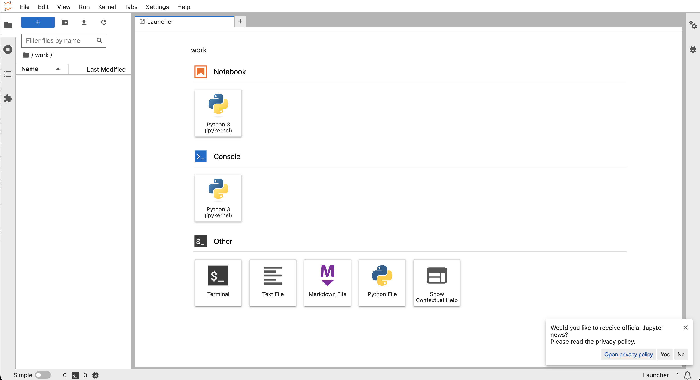
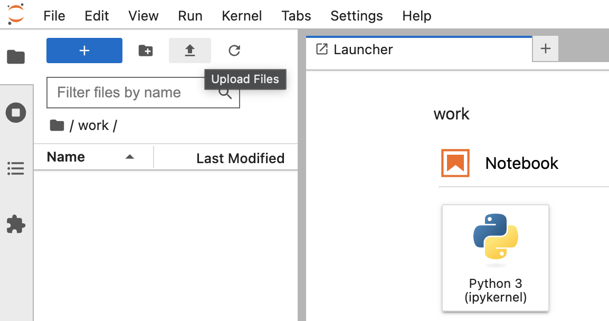
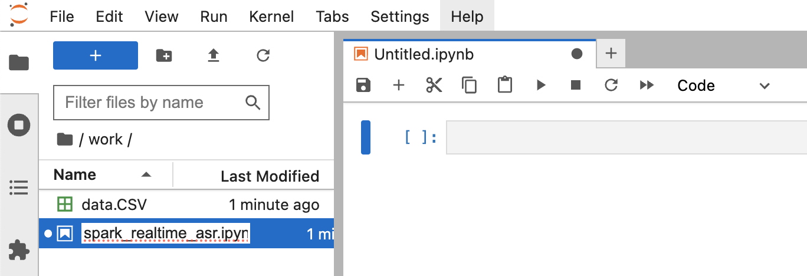

# Lab 12 & 13 Stream Data Pipeline III - Spark¶

- Scenario: Streaming audio 

Stream in audio, process, calling a machine learning classification model and save the data for reporting.

Create a new jupyter notebook file "stream\_data\_pipeline\_3\_spark.ipynb".

In [ ]:

```
import os
os.chdir('/Users/<username>/projects/ee3801')
```

# 1. Spark without Clusters¶

# 1.1 Install Spark¶

1. Go to the directory and create the following directories.

    `cd /Users/<username>/projects/ee3801/dev_spark`

    `mkdir work-dir`
2. Pull docker image and run docker container.

    `docker pull spark`

    `docker run --name dev_pyspark -it -v /Users/<username>/projects/ee3801/dev_spark/work-dir:/opt/spark/work-dir -p 8888:8888 -p 8090:8080 -p 4040:4040 spark:python3 /opt/spark/bin/pyspark`
3. Pull docker image and run docker container.

    `docker pull jupyter/pyspark-notebook`

    `docker run --name dev_jupyter_pyspark -d -v /Users/<username>/projects/ee3801/dev_spark/work-dir:/home/jovyan/work -p 8888:8888 -p 8090:8080 -p 4040:4040 -p 4041:4041 jupyter/pyspark-notebook:latest`

# 1.2 Introduction to Spark¶

1. Access jupyter spark notebook. Go to docker container dashboard dev\_jupyter\_pyspark's `Logs`. Click on the link http://127.0.0.1:8888/lab?token=************.
2. Access the work folder.
3. Create a jupyter notebook file using Python3 (ipykernel) in Notebook.


4. Upload data.CSV to jupyter spark. Rename your Untitled.ipynb file as `spark_realtime_asr.ipynb`.



5. Install findpark.

    `!pip3 install findspark`
6. Import and initialise findspark. If there is no error that means it is executed correctly.

    `import findspark`

    `findspark.init()`
7. Enter the the following codes to test the installed spark and jupyter.

In [ ]:

```
from pyspark.sql import SparkSession

# Spark session & context
spark = SparkSession.builder.master("local").getOrCreate()
sc = spark.sparkContext

# Test PySpark
spark.range(5).show()
```

1. Enter the the following codes for parallel processing in spark.

In [ ]:

```
from pyspark.sql import SparkSession

# Spark session & context
spark = SparkSession.builder.master("local").appName('Local-Sum100').getOrCreate()
sc = spark.sparkContext

# Sum of the first 100 whole numbers
rdd = sc.parallelize(range(100 + 1))
rdd.sum()
```

1. Enter the the following codes to read file as a dataframe.

In [ ]:

```
spark=SparkSession.builder.master('spark://pop-os.localdomain:7077').appName('ReadingFileToDataFrame').getOrCreate()
df = spark.read.csv('data.CSV')
df.show(5)
df.printSchema()
```

# 2. Install Spark on docker in EC2 Instance¶

If you have not created an ec2 instance for ee3801 part 2, go to "2. batch\_data\_pipeline.html" to create the instance and install docker before continuing with the instructions below.

1. Launch the ee3801part2 instance
2. Click on the instance and click Connect. Go to SSH client. Copy the Example.
3. Open a terminal and ssh into server.
4. You can install Kafka in this docker in EC2 instance by following the instructions in section 1.2 in this lab but take note:

    - Name the folder as uat\_spark
    - Name the containers as uat\_pyspark and uat\_jupyter\_spark
5. To access the server from browser, you will need to access EC2 &gt; Security Groups &gt; Edit inbound rules &gt; Add rule &gt; Save rules

    ```
    Type: Custom TCP
    Port Range: 8888
    Source: Anywhere-IPv4
    ```
6. Go to browser `public ip:8888`

In this lab we have created the development environment on local machine's docker and user acceptance test (uat) environment on EC2 instance's docker. This is to fully test the systems before pushing to a live production server. We will not cover production environment in this module.

# 3. Spark with Clusters¶

In this section, I will refer to an online resource https://github.com/cluster-apps-on-docker/spark-standalone-cluster-on-docker to illustrate the spark with standalone cluster on docker.

1. Go to dev\_spark folder and download the docker-compose.yml file.

    `cd dev_spark`

    `curl -LO https://raw.githubusercontent.com/cluster-apps-on-docker/spark-standalone-cluster-on-docker/master/docker-compose.yml`
2. The default versions for each tech stack are [here](https://github.com/cluster-apps-on-docker/spark-standalone-cluster-on-docker?tab=readme-ov-file#tech-stack). We will take the default settings for our practice.
3. Start the cluster.

    `docker compose up`
4. This [website](https://www.kdnuggets.com/2020/07/apache-spark-cluster-docker.html) has a detailed explanation on the architecture of the spark clusters setup.


5. Why do you think we need a cluster setup?
6. Assignment (Choose one to complete):

    - Proof and justify the need for a spark cluster setup.
    - Comsume audio data in spark from kafka.
    - In your own words, what do you think are the functions, strength of
        - airflow
        - kafka
        - spark
        - postgresql
        - elasticsearch
    - In many real-world applications, the companies combined using kafka and spark. Research on the reason and justify why they need kafka and spark together.

# Conclusion¶

You have successfully setup spark without cluster and spark with cluster.

# Submissions by Wed 9pm (13 Nov 2024)¶

Submit your ipynb as a pdf. Save your ipynb as a html file, open in browser and print as a pdf. Include in your submission:

```
Section 2
```